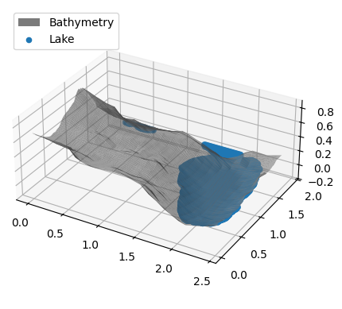
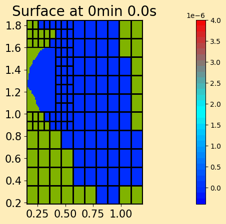
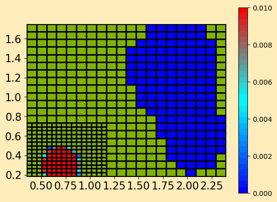

# TODO
- [x] Traiter les données de Gruner pour en tirer une topographie utilisable et assez légère pour des calculs rapides.
- [x] Installer Clawpack correctement (5.9.0). La version 5.9.2 ne résout pas les équations de Boussinesq et la 5.10.0 exige la librairie PETSC.
- [x] Simuler une première vague depuis un champ de vitesse ou de hauteur initial.
- [x] Simuler une première avalanche avec AVAC.
- [ ] Introduire la quantité de mouvement par les conditions de bord et non par la solution initiale.
- [ ] Apprendre à transférer la quantité de mouvement de la neige vers l'eau (Flume).
- [ ] Ajouter des graphes de l’intumescence au barrage (ligne de jauges).
- [ ] Inclure le barrage dans la topographie.
- [ ] Benchmark selon les expériences VAW+LHE (test des conditions de bord)?

# Questions
- Y a-t-il des effets d'échelle ?
- David L. George, D-CLAW => simplement mettre un coefficient de transfert de quantité de mouvement?

# Problèmes
- GitHub/AVAC: `qinit_module.f90` est bien corrigé mais il n'est pas mentionné dans la liste des modules du Makefile. Il faudrait écrire:
```Makefile
EXCLUDE_MODULES = \
  $(GEOLIB)/qinit_module.f90
MODULES = \
  ./module_voellmy.f90 \
  ./qinit_module.f90 \
```
Par ailleurs, les versions les plus récentes de Clawpack remplacent toutes les mentions de `python` par la variable `$(PYTHON)` définie dans le `Makefile.common`.
- AVAC/GRASS: L'archive `toraval.fr/r.avac.tar.gz` n'existe plus, tout est dans le git mais le manuel renvoie vers le site de toraval.
- La mémoire fait parfois défaut dans le code, les coordonnées en mètres sont trop grandes. D'où la question sur les effets d'échelle.

# Avancement du projet
Je mettrai ici à jour mon avancement à chaque étape.

Pour rappel pour les deux figures suivantes, la topographie ressemble à ceci:



## Vague introduite par une vitesse initiale
Il reste à introduire l'information par les conditions de bord et à mesurer l'état au niveau du barrage.



## Première avalanche
Il faut encore mesurer hauteur et vitesse à l'entrée de l'avalanche.
De plus, il en reste beaucoup d'autres à faire.


# Divers
- Notes de cours sur ClawPack: là où il est écrit "or directly in the Makefile:", il faut remplacer le code par:
```Makefile
parallel:
	export FFLAGS='-O2 -fopenmp'
	export OMP_NUM_THREADS=4
```
- Installation de Clawpack: Boussinesq n'est pas inclus dans la v5.9.2, la v5.10.0 utilise PETSC pour résoudre ces équations. La version 5.9.0 est ici utilisée car j'ai surchauffé en essayant les deux dernières versions.

# À explorer 
- Réessayer de lancer les exemples `tsunami_benchmarks: problem1 & problem1_take2`.
- code cayle mandeli : two layer shallow water (water and avalanche?) rpn2_layered (clawpack/dev)
- Créer des fichiers setrun et setplot en [yaml](https://python.land/data-processing/python-yaml)?